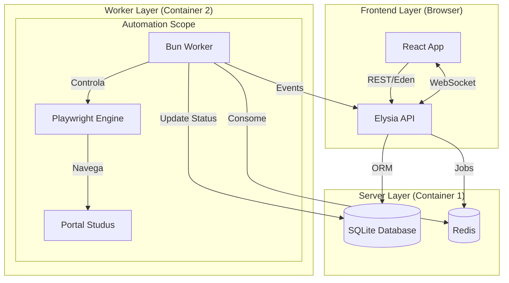

# Arquitetura Studus Automatizado (Revisada)

## Visão Geral

Esta arquitetura foi revisada para alinhar-se estritamente aos requisitos de performance, stack tecnológica (Bun) e usabilidade (React) do projeto. O foco é manter a estabilidade da automação isolando o processo pesado (browser) da interface do usuário.

### Stack Tecnológica

*   **Runtime:** [Bun](https://bun.sh) (v1.x) - Utilizado em todos os serviços para performance e DX.
*   **Frontend:** React (Vite) - SPA para monitoramento reativo em tempo real.
*   **Backend API:** [ElysiaJS](https://elysiajs.com) - Framework de alta performance nativo para Bun.
*   **Automação (Worker):** Playwright + Bun - Execução headless isolada.
*   **Banco de Dados:** SQLite (via LibSQL ou native driver) gerenciado pelo **Drizzle ORM**.
*   **Fila/Async:** BullMQ + Redis - Gerenciamento de tarefas e retentativas.

### Diagrama de Arquitetura



---

## Fluxos de Automação

### 1. Login e Sessão (Estratégia "Lazy")

Diferente do modelo tradicional, não mantemos sessão viva eternamente. O worker recria ou recupera o contexto conforme necessário.

1.  **Usuário** solicita "Sincronizar" no Frontend.
2.  **API** cria um Job `SYNC_DISCIPLINES` na fila `studus-queue`.
3.  **Worker** pega o job:
    *   Verifica se existe cookie de sessão válido no Banco.
    *   **Se sim:** Restaura cookies no Playwright e testa acesso.
    *   **Se não (ou expirado):**
        *   Inicia fluxo de Login (Headless).
        *   Se falhar (Captcha/Erro): Marca Job como `FAILED` e pede intervenção manual ou retenta.
        *   Se sucesso: Salva novos cookies criptografados no Banco.
4.  **Worker** navega para página de disciplinas.
5.  **Worker** extrai dados (Scraping) e atualiza o Banco.
6.  **Worker** notifica sucesso via Pub/Sub (Redis) que chega ao Frontend via WebSocket.

---

## Estrutura de Diretórios Proposta

Adotaremos uma estrutura de **Monorepo** simplificada usando Bun Workspaces. Isso permite compartilhar tipos (TypeScript Interfaces) entre Frontend, Backend e Worker sem duplicação.

```text
/
├── package.json          # Workspaces config
├── bun.lockb
├── docker-compose.yml
├── .env
│
├── packages/
│   └── shared/           # Tipos compartilhados (DTOs, Enums)
│       ├── index.ts
│       └── types/
│           ├── task.ts
│           └── studus.ts
│
├── apps/
│   ├── web/              # Frontend (React + Vite)
│   │   ├── src/
│   │   │   ├── components/
│   │   │   ├── hooks/
│   │   │   └── stores/   # Zustand ou React Context
│   │   └── ...
│   │
│   ├── api/              # Backend (ElysiaJS)
│   │   ├── src/
│   │   │   ├── index.ts
│   │   │   ├── db/       # Drizzle Config & Schemas
│   │   │   ├── routes/
│   │   │   └── services/
│   │   └── ...
│   │
│   └── worker/           # Automação (Bun + Playwright)
│       ├── src/
│       │   ├── index.ts
│       │   ├── automation/
│       │   │   ├── browser.ts
│       │   │   └── studus.actions.ts
│       │   └── processors/
│       └── ...
```

---

## Componentes Chave

### 1. Banco de Dados (Schema Drizzle)

```typescript
// packages/shared/schema.ts (Exemplo conceitual)

export const tasks = sqliteTable('tasks', {
  id: integer('id').primaryKey(),
  type: text('type').notNull(), // 'LOGIN', 'SYNC', 'UPDATE_FREQ'
  status: text('status').default('PENDING'), // 'PENDING', 'RUNNING', 'COMPLETED', 'FAILED'
  payload: text('payload', { mode: 'json' }), // Dados para execução
  result: text('result', { mode: 'json' }),   // Resultado ou erro
  createdAt: integer('created_at', { mode: 'timestamp' }),
});

export const taskLogs = sqliteTable('task_logs', {
  id: integer('id').primaryKey(),
  taskId: integer('task_id').references(() => tasks.id),
  level: text('level'), // 'INFO', 'WARN', 'ERROR'
  message: text('message'),
  screenshotPath: text('screenshot_path'), // Caminho da imagem em caso de erro
});
```

### 2. Gerenciamento de Fila (Worker)

O Worker deve ser resiliente. Se o browser travar, o processo deve reiniciar sem perder o job.

```typescript
// apps/worker/src/index.ts
import { Worker } from 'bullmq';
import { processTask } from './processors';

const worker = new Worker('studus-queue', async (job) => {
  console.log(`Processing job ${job.id}: ${job.name}`);
  
  // Wrapper para garantir cleanup do browser
  try {
    return await processTask(job);
  } catch (error) {
    // Captura screenshot global se algo catastrófico ocorrer
    await captureErrorState(error);
    throw error;
  }
}, { connection: redisConfig });
```

---

## Estratégia de Deploy e Execução

### Docker Compose

Separamos os serviços para garantir que o consumo de memória do Chrome não afete a API.

```yaml
version: '3.8'

services:
  # Serviço de API e Banco
  api:
    image: oven/bun:1
    command: bun run start:api
    ports:
      - "3000:3000"
    volumes:
      - .:/app
    depends_on:
      - redis

  # Serviço de Frontend (Dev ou Build Server)
  web:
    image: oven/bun:1
    command: bun run dev:web
    ports:
      - "5173:5173"
    volumes:
      - .:/app

  # Serviço Worker (Pesado)
  worker:
    image: oven/bun:1
    # Instalar deps do Playwright no startup ou usar imagem customizada
    command: /bin/sh -c "bun install && bun x playwright install --with-deps chromium && bun run start:worker"
    volumes:
      - .:/app
    environment:
      - BROWSER_HEADLESS=true

  redis:
    image: redis:alpine
```

## Próximos Passos para Implementação

1.  **Setup do Monorepo:** Inicializar `package.json` com workspaces.
2.  **Database:** Configurar Drizzle e criar migração inicial (Tabelas de Tasks e Logs).
3.  **Worker Skeleton:** Criar o script básico que conecta no Redis e abre/fecha o Playwright.
4.  **API Basic:** Endpoints para criar Task e listar Tasks.
5.  **Frontend:** Dashboard simples consumindo a API.
